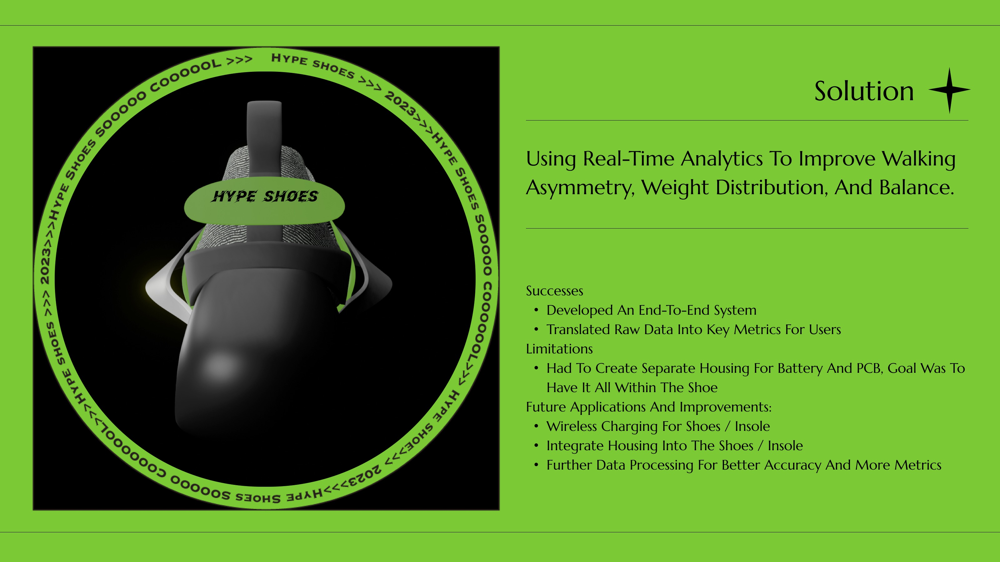
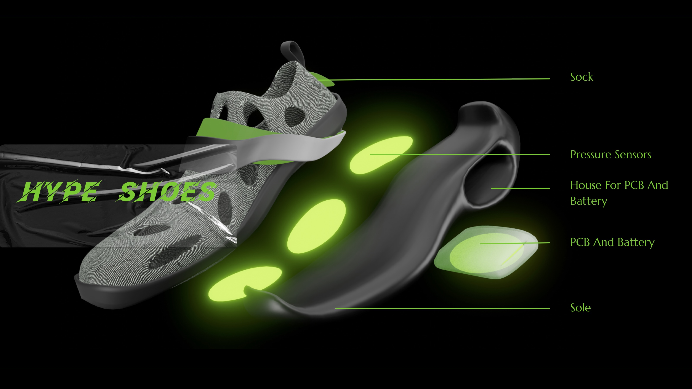
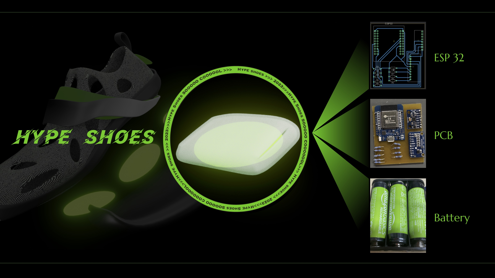
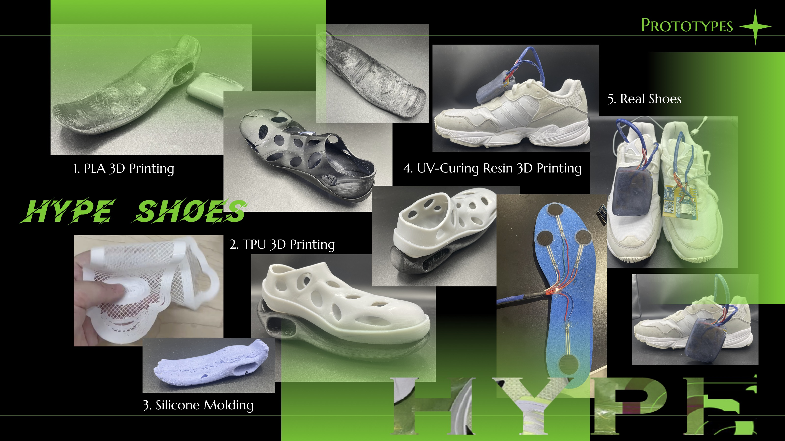

# Hype Shoes

# Describe the technology that you developed.

The technology we have developed involves the use of hardware components such as the ESP32 microcontroller, MPU6050 sensor, ADS1115 analog-to-digital converter, and multiple force sensors. These components are implemented in each shoe to sense the user's movement and gaiting pattern.

The MPU6050 sensor is a six-axis motion tracking device that can detect acceleration and angular velocity. The ADS1115 analog-to-digital converter is used to convert the analog signal from the force sensors into digital signals that can be processed by the microcontroller.

The microcontroller, in this case, the ESP32, is the brain of the system. It receives the sensor data from the MPU6050, ADS1115, and force sensors and processes it to extract information about the user's walking pattern.

The gaiting data is then sent to the backend, where it is analyzed using various algorithms to detect any abnormalities in the user's walking pattern. The backend may also provide recommendations for corrective actions to improve the user's gait.

The frontend is the user interface that displays the live gaiting data and other useful features for users to understand their walk. This may include visualizations of the user's walking pattern, such as graphs and charts, as well as notifications and alerts for any detected abnormalities.

# Deck

